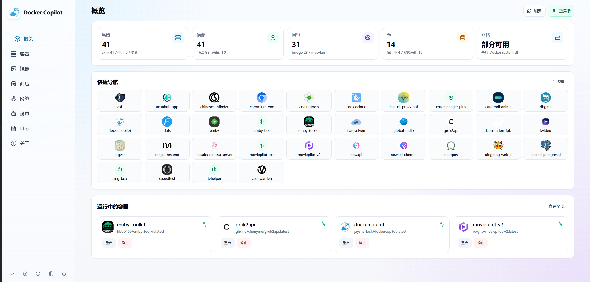
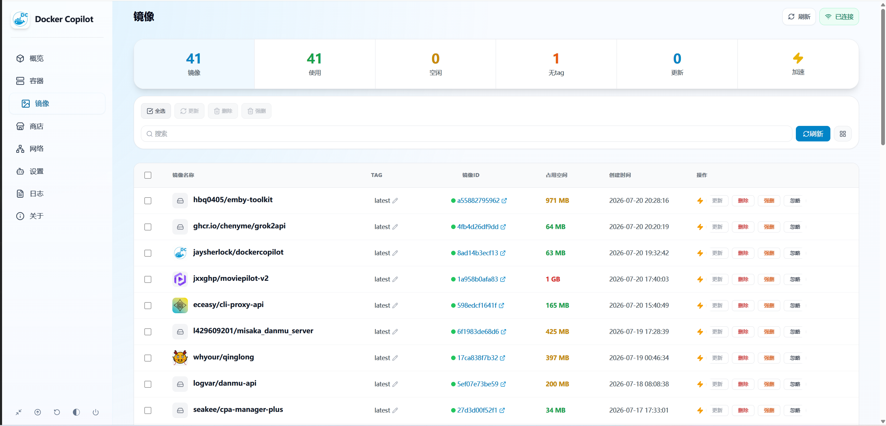
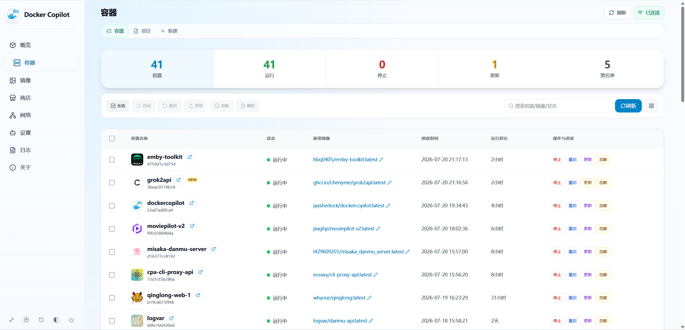

# DockerCopilot

<a href="https://www.gnu.org/licenses/agpl-3.0.en.html">
  
</a>

> 🛠️ 维护版：`2.1.32`  
> ❤️ 基于原作者 [onlyLTY/dockerCopilot](https://github.com/onlyLTY/dockerCopilot) 持续演进，感谢原作者开源贡献。

DockerCopilot 是一个面向日常运维的 Docker 管理工具，提供 🖥️ **Web 面板** + 📱 **Mobile 面板** + 🤖 **Telegram Bot** + 🐧 **QQ Bot**，适合 NAS、Linux 主机和家庭服务器统一管理容器、镜像、日志、备份与更新。

## ✨ 2.1.32 看点
- 🔄 **镜像级自更新**：面板可直接更新 DockerCopilot 自身容器——接力容器完成"停旧建新"，失败自动回滚，结果推送到 Bot（原版屏蔽了自身更新）
- 💾 **配置持久化加固**：Bot 配置统一存放于 `/data/config/config.json`，旧路径自动迁移，容器重建不再丢配置；`/data` 未挂载时启动醒目告警
- 🐞 修复局部保存配置（如添加镜像加速源）会意外关闭 Telegram/QQ Bot 开关的问题
- 🧭 **概览页容器 Web 快捷导航**：自动识别容器暴露的端口并生成快捷入口，一键直达各容器 WebUI
- 🎨 **自动读取 favicon 图标**：容器与快捷导航自动抓取站点 favicon 作为图标，面板一眼可辨
- 🐧 **初步支持 QQ Bot**：容器/镜像查询、更新检测与通知，交互按 QQ 官方机器人特性适配
- 🔁 更新检测后台定时执行（默认每 30 分钟），前端打开不再触发误推送
- 🖥️ PC 与 📱 Mobile 双端统一体验，共用登录态
- 🐳 容器管理、镜像管理、日志查看、备份恢复、定时任务一站式完成
- 🤖 Telegram Bot 支持多实例管理、自动更新、自动清理与通知

## 🖼️ 界面预览

**概览 · 容器 Web 快捷导航**

宫格式罗列已暴露 WebUI 的容器，点击直接在新标签打开对应服务。



**概览 · 运行中容器**

一屏总览运行状态、资源占用与快捷操作。



**容器列表 · 自动 favicon 图标**

无需手动配置，面板自动抓取各容器站点的 favicon 作为图标，也支持自定义覆盖。



## 🚀 推荐镜像
```text
jaysherlock/dockercopilot:latest
```

## 🧭 快速开始
1. 拉取镜像：

```bash
docker pull jaysherlock/dockercopilot:latest
```

2. 新建 `docker-compose.yml`，推荐直接使用下面的配置示例：

```yaml
services:
  dockercopilot:
    image: jaysherlock/dockercopilot:latest
    container_name: dockercopilot
    restart: unless-stopped
    privileged: true
    network_mode: host
    volumes:
      - /var/run/docker.sock:/var/run/docker.sock
      # /data 为唯一持久化目录：Bot 配置、备份、图标均在其中，必须挂载
      - ./data:/data
    environment:
      TZ: Asia/Shanghai
      DOCKER_HOST: unix:///var/run/docker.sock
      secretKey: please-change-me
      BACKUP_DIR: /data/backups
      WORKDIR: /app
```

> ⚠️ **务必挂载 `/data`**：Telegram/QQ Bot 配置、备份文件都保存在 `/data` 中，未挂载时容器重建会导致配置丢失（旧版本存放于 `/app/config` 的配置会在启动时自动迁移到 `/data/config`）。Bot 的 Token、通知开关等请在面板「Bot 配置」页设置，环境变量方式不受支持。

3. 修改 `secretKey`，按需填写 Telegram Bot 配置。
4. 启动：

```bash
docker compose up -d
```

5. 访问：

```text
PC 管理端： http://宿主机IP:12712/manager
移动端：   http://宿主机IP:12712/m
```

- 如果使用 bridge 网络，请先确认已正确映射 `12712:12712`

## 📱 双手机端 UI 适配
DockerCopilot 同时提供两套适合手机访问的入口，可按使用场景选择：

- `/manager`：PC 管理端已做响应式移动端适配，手机浏览器可直接打开，适合需要完整桌面管理能力、并希望手机与电脑界面一致的场景。
- `/m`：独立移动端 UI，布局更轻量，按钮更集中，底部导航更适合触屏操作，适合日常手机巡检、容器启停、镜像更新、日志查看和程序更新。
- 两个入口共用同一后端 API 与登录态，登录一次后可在 PC 适配页和独立移动页之间切换。
- 在 PC 管理端的手机分辨率下，页面右上角提供“手机传送”入口，可快速跳转到 `/m`。

## 🧩 配置说明
### 推荐部署：host 网络
推荐直接使用 host 网络，WebUI 链接更稳定，也更适合 NAS / 家用服务器。

### 常用环境变量
| 变量 | 说明 |
| --- | --- |
| `secretKey` | Web 登录密钥，建议修改为强密码 |
| `TZ` | 时区，建议 `Asia/Shanghai` |
| `DOCKER_HOST` | Docker socket 地址，通常为 `unix:///var/run/docker.sock` |
| `BACKUP_DIR` | 备份目录，建议 `/data/backups` |
| `WORKDIR` | 程序工作目录，通常为 `/app` |
| `DOCKERCOPILOT_BOT_CONFIG` | Bot 配置文件路径，默认 `/data/config/config.json`，一般无需修改 |
| `DOCKERCOPILOT_CONFIG_FILE_MODE` | `config.json` 文件权限（八进制），默认 `666` 便于宿主机文管直接查看编辑；注重私密性可设为 `600` |
| `PUID` / `PGID` | 设置后 `config.json` 及所在目录的属主会指定为该 UID/GID，适合把配置归属到 NAS 登录账号 |
| `HOST_LAN_IP` | bridge 模式下建议设置宿主机局域网 IP |

> Telegram / QQ Bot 的 Token、通知开关、自动清理与自动更新等均在面板「Bot 配置」页设置并持久化到 `/data/config/config.json`，不通过环境变量配置。
>
> 2.1.35 起 `config.json` 默认权限为 `666`（历史版本为 root 属主的 `600`，宿主机普通账号无法查看编辑）；升级后启动时会自动修正存量文件的权限。

### bridge 模式提示
如果必须使用 bridge：
- 记得映射 `12712:12712`
- 建议补充 `HOST_LAN_IP`
- 容器 WebUI 链接会更准确

## 🤖 机器人
- **Telegram Bot**：inline 键盘菜单交互，支持容器/镜像管理、批量更新、备份、多实例切换，更新检测结果去重推送。
- **QQ Bot（初步支持）**：接入 QQ 官方机器人（WebSocket / Webhook 双模式），支持容器与镜像查询、更新检测与通知；消息与按钮交互按 QQ 渠道特性适配，通知精简合并以贴合官方主动消息限制。在设置页填入 AppID / AppSecret 并配置可用会话即可启用。

## 📦 更新说明
- 容器更新：支持 Web / Bot / 批量更新
- **面板自身更新（镜像级）**：容器列表中直接更新 DockerCopilot 自身。流程为：拉取新镜像 → 启动一次性接力容器 → 停旧建新（保留原有配置与挂载）→ 启动校验，失败自动回滚旧版本，结果通过 Bot 推送。期间面板中断十几秒后自动恢复。
- 二进制热替换：关于页保留"拉取二进制更新"作为降级方案，适合 socket 受限场景（注意：该方式不更新镜像基础层）
- 黑名单：可避免误更新关键容器

架构规则见 [更新状态与前端拆分架构](docs/architecture/update-state.md)。更新检测、黑名单统计和概览数字以后端 `UpdateStore`、`blacklist.Matcher`、`summary` 为统一口径，前端只做筛选和展示。

## 🛠️ 开发构建
```bash
npm install
npm run build:front
```

- `/manager` 当前已做响应式移动端适配，但移动端专用入口仍推荐 `/m`
- `build:pc` 会输出到 [`front/pc`](front/pc)
- `build:mobile` 会生成并同步到 [`front/mobile`](front/mobile)
- Go 后端会把两套前端嵌入二进制
- 具体构建方式可参考 [`scripts`](dockerCopilot/scripts) 目录内的自动构建脚本：[`build-debian.sh`](dockerCopilot/scripts/build-debian.sh)、[`build-windows.cmd`](dockerCopilot/scripts/build-windows.cmd)、[`sync-mobile.mjs`](dockerCopilot/scripts/sync-mobile.mjs)

## 🙏 致谢
再次感谢原作者 [onlyLTY/dockerCopilot](https://github.com/onlyLTY/dockerCopilot) 的优秀工作与持续维护。

## 📄 License

本项目遵循 **GNU AGPL v3.0** 协议开源，与原作者 [onlyLTY/dockerCopilot](https://github.com/onlyLTY/dockerCopilot) 保持一致。本仓库为其衍生作品，同样以 AGPL v3.0 授权。

AGPL v3.0 的主要要求：
- **保留版权与许可声明**：分发或修改时须保留原作者版权信息及本许可证副本（见 [LICENSE](LICENSE)）。
- **衍生作品同样开源**：基于本项目的修改和二次开发必须以 AGPL v3.0 继续开源，不得闭源。
- **网络使用也需提供源码**（AGPL 相较 GPL 的核心条款）：即使不分发二进制，只要通过网络向用户提供本软件的服务，也必须向这些用户提供对应的完整源代码。
- **标注改动**：对源码的修改需注明修改者与修改说明。

完整源代码：<https://github.com/ifsherlock/dockerCopilot>
上游项目：<https://github.com/onlyLTY/dockerCopilot>

许可证全文见 [LICENSE](LICENSE)。
